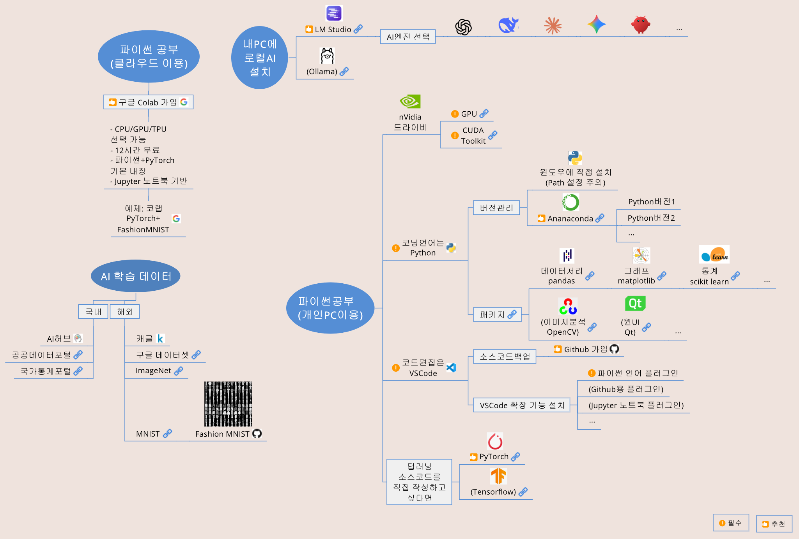

## 한국섬유공학회 춘계학술대회 2026-04-27
### 섬유고분자물질 분석을 위한 AI·오픈소스 기술 배경 이해
#### 금오공과대학교 설인환

#### ※ 스마트폰에서는 위의 "코드"를 누르면 파일 목록이 보입니다.

#### ※ .xmind 파일에는 URL 링크가 들어 있습니다. 뷰어는 xmind.com 에서 무료로 받을 수 있습니다.

#### ※ 본 자료는 자유롭게 수정/사용해도 됩니다(CC BY).

